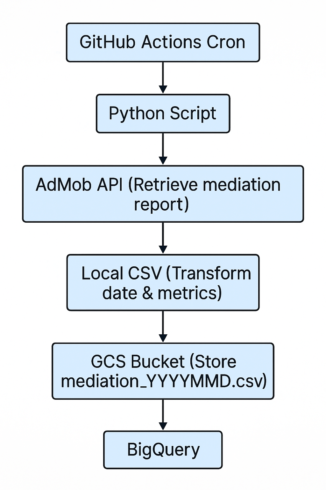

# AdMob → BigQuery Data Pipeline Documentation

## Overview
This document provides a comprehensive guide to setting up and maintaining an automated data pipeline that:
1. Authenticates with the AdMob API to retrieve mediation reports on a daily basis.
2. Transforms and writes the data to CSV.
3. Uploads the CSV to a Google Cloud Storage (GCS) bucket.
4. Loads the CSV into a BigQuery dataset and table.
5. Demonstrates sample SQL queries for downstream analysis.

## Table of Contents
1. [Prerequisites](#prerequisites)
2. [Architecture Diagram](#architecture-diagram)
3. [Configuration](#configuration)
4. [Python Script Breakdown](#python-script-breakdown)
   - [Authentication](#authentication)
   - [Fetching & Flattening the Report](#fetching--flattening-the-report)
   - [CSV Generation](#csv-generation)
   - [GCS Upload](#gcs-upload)
   - [BigQuery Load](#bigquery-load)
5. [Google Cloud Setup](#google-cloud-setup)
   - [Service Account & IAM Roles](#service-account--iam-roles)
   - [BigQuery Table Schema](#bigquery-table-schema)
6. [Cron Scheduling with GitHub Actions](#cron-scheduling-with-github-actions)
7. [Sample SQL Queries](#sample-sql-queries)
8. [Error Handling & Troubleshooting](#error-handling--troubleshooting)
9. [Appendix](#appendix)

---

## Prerequisites
- Google Cloud project with BigQuery and Cloud Storage APIs enabled.
- AdMob account with API access.
- Service account JSON key for GCS & BigQuery operations.
- GitHub repository with Actions enabled.

## Architecture Diagram
```
[GitHub Actions Cron] → [Python Script]
     ↓
[AdMob API] → Retrieve mediation report (stream)
     ↓
[Local CSV] → Transform date and metrics
     ↓
[GCS Bucket] → Store `mediation_YYYYMMDD.csv`
     ↓
[BigQuery] → Load table with schema
```

<p align="left">
  
</p>

## Configuration

### Environment Variables
| Name                  | Description                                  |
|-----------------------|----------------------------------------------|
| ADMOB_CLIENT_ID       | OAuth client ID from Google Cloud Console    |
| ADMOB_CLIENT_SECRET   | OAuth client secret                          |
| ADMOB_REFRESH_TOKEN   | Refresh token obtained from OAuth flow       |
| ADMOB_PUBLISHER_ID    | Your AdMob publisher ID (e.g. `pub-123456…`) |
| GCP_PROJECT           | Google Cloud project ID                      |
| GCS_BUCKET_NAME       | Name of the target GCS bucket                |
| BQ_DATASET            | BigQuery dataset name                        |
| BQ_TABLE              | BigQuery table name                          |

Store these in GitHub **Secrets** or **Variables** for secure access.

---

## Python Script Breakdown

### Authentication
```python
from google.oauth2.credentials import Credentials
from google.auth.transport.requests import Request

def get_admob_creds():
    creds = Credentials(
        token=None,
        refresh_token=REFRESH_TOKEN,
        token_uri="https://oauth2.googleapis.com/token",
        client_id=CLIENT_ID,
        client_secret=CLIENT_SECRET,
        scopes=[API_SCOPE],
    )
    creds.refresh(Request())
    return creds
```
- Uses the refresh token to obtain a fresh access token each run.

### Fetching & Flattening the Report
```python
spec = {
    "dateRange": { ... },
    "dimensions": [...],
    "metrics": [...],
    "sortConditions": [{"dimension": "DATE", "order": "ASCENDING"}]
}
response = service.accounts().mediationReport().generate(
    parent=f"accounts/{PUBLISHER_ID}",
    body={"reportSpec": spec}
).execute()
```
- The response is a list of streaming chunks.
- Each `chunk["row"]` contains `dimensionValues` and `metricValues`.

#### Extracting Display Names
```python
dims = chunk["row"]["dimensionValues"]
app_name = dims["APP"].get("displayLabel", dims["APP"]["value"])
```
- `displayLabel` gives the human‐readable name; fallback to `value` if missing.

### CSV Generation
```python
import csv
with open(local_path, "w", newline="") as f:
    writer = csv.writer(f)
    writer.writerow([...header...])
    writer.writerows([...rows...])
```
- Always open with `newline=''` to prevent blank lines.

### GCS Upload
```python
from google.cloud import storage
client = storage.Client(project=GCP_PROJECT)
bucket = client.bucket(GCS_BUCKET_NAME)
bucket.blob(filename).upload_from_filename(local_path)
```

### BigQuery Load
```python
from google.cloud import bigquery
client = bigquery.Client(project=GCP_PROJECT)
job_config = bigquery.LoadJobConfig(
    source_format=bigquery.SourceFormat.CSV,
    skip_leading_rows=1,
    autodetect=False,
    write_disposition="WRITE_TRUNCATE"
)
client.load_table_from_uri(gcs_uri, f"{GCP_PROJECT}.{BQ_DATASET}.{BQ_TABLE}", job_config=job_config).result()
```

---

## Google Cloud Setup

### Service Account & IAM Roles
1. **Create** a service account (`admob-export-sa`).
2. **Grant** it:
   - **Storage Object Admin** on your GCS bucket.
   - **BigQuery Data Editor** and **BigQuery Job User** on your dataset.

### BigQuery Table Schema
| Field                   | Type    | Mode      |
|-------------------------|---------|-----------|
| `date`                  | DATE    | NULLABLE  |
| `app_name`              | STRING  | NULLABLE  |
| `ad_unit_name`          | STRING  | NULLABLE  |
| `ad_source_name`        | STRING  | NULLABLE  |
| `ad_source_instance_name` | STRING| NULLABLE  |
| `mediation_group_name`  | STRING  | NULLABLE  |
| `country`               | STRING  | NULLABLE  |
| `ad_requests`           | INTEGER | NULLABLE  |
| `clicks`                | INTEGER | NULLABLE  |
| `estimated_earnings_micros` | INTEGER | NULLABLE |
| `impressions`           | INTEGER | NULLABLE  |
| `impression_ctr`        | FLOAT   | NULLABLE  |
| `matched_requests`      | INTEGER | NULLABLE  |
| `match_rate`            | FLOAT   | NULLABLE  |
| `observed_ecpm_micros`  | INTEGER | NULLABLE  |

---

## Cron Scheduling with GitHub Actions
```yaml
name: 📊 Daily AdMob → BigQuery

on:
  schedule: [{ cron: '0 1 * * *' }]  # 01:00 UTC
  workflow_dispatch:

jobs:
  export:
    runs-on: ubuntu-latest
    steps:
      - uses: actions/checkout@v3
      - uses: google-github-actions/auth@v1
        with:
          credentials_json: ${{ secrets.GCP_SA_KEY }}
      - uses: actions/setup-python@v4
        with: { python-version: '3.9' }
      - run: pip install -r requirements.txt
      - run: python save_JSON.py
        env:
          ADMOB_CLIENT_ID: ${{ secrets.ADMOB_CLIENT_ID }}
          ADMOB_CLIENT_SECRET: ${{ secrets.ADMOB_CLIENT_SECRET }}
          ADMOB_REFRESH_TOKEN: ${{ secrets.ADMOB_REFRESH_TOKEN }}
          ADMOB_PUBLISHER_ID: ${{ vars.ADMOB_PUBLISHER_ID }}
          GCP_PROJECT: ${{ vars.GCP_PROJECT }}
          GCS_BUCKET_NAME: ${{ vars.GCS_BUCKET_NAME }}
          BQ_DATASET: ${{ vars.BQ_DATASET }}
          BQ_TABLE: ${{ vars.BQ_TABLE }}
```

---

## Sample SQL Queries
### Total Estimated Earnings (micros)
```sql
SELECT SUM(estimated_earnings_micros) AS total_earnings_micros
FROM `{{ project }}.{{ dataset }}.{{ table }}`;
```
### Total Estimated Earnings (USD)
```sql
SELECT ROUND(SUM(estimated_earnings_micros)/1e6, 2) AS total_earnings_usd
FROM `{{ project }}.{{ dataset }}.{{ table }}`;
```

---

## Error Handling & Troubleshooting
- **`KeyError: 'row'`**: skip chunks without `"row"`.
- **TypeError on metrics**: use `get_int()`/`get_float()` helpers to default missing to zero.
- **Date parse errors**: ensure your CSV’s `date` column is `YYYY-MM-DD`.

---

## Appendix
- [AdMob Reporting API Reference](https://developers.google.com/admob/api/reference/rest)  
- [BigQuery Load Job Config docs](https://cloud.google.com/python/docs/reference/bigquery/latest/google.cloud.bigquery.LoadJobConfig)  
- [Cloud Storage Python Client](https://googleapis.dev/python/storage/latest/index.html)
